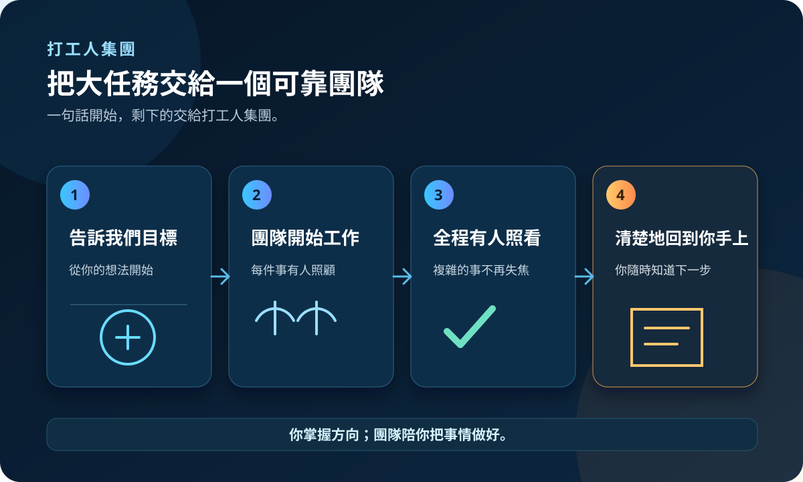
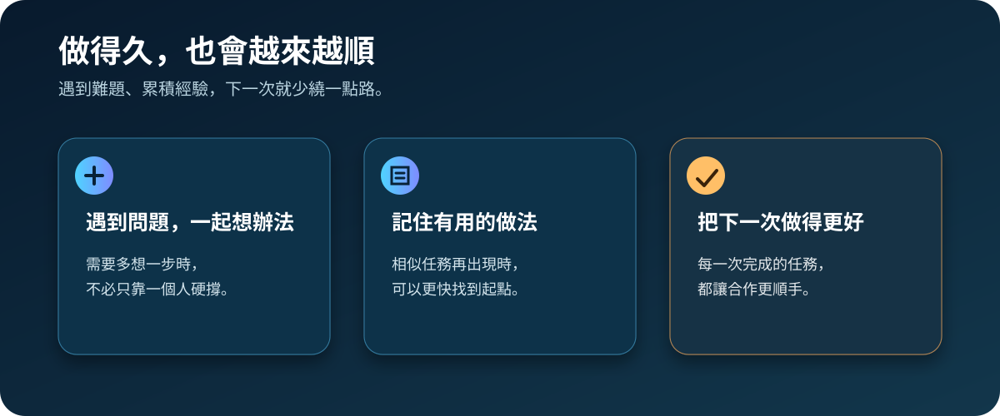

# 打工人集團 Workers Group

<p align="center">
  
</p>

<p align="center">
  <strong>把複雜任務，交給一個有分工的 Codex 團隊。</strong><br>
  安裝一次，之後每個專案都能叫它來幫忙。
</p>

<p align="center">
  <a href="#開始使用">開始使用</a> ·
  <a href="docs/安裝教學.md">完整安裝教學</a> ·
  <a href="docs/安全說明.md">安全說明</a> ·
  <a href="docs/產品導覽.html">產品導覽</a>
</p>

> 本專案由社群維護。安裝前請先閱讀[安全說明](docs/安全說明.md)。

## 它適合誰

如果你要做的是網站改版、新功能、程式整理、測試或交接文件，而且事情不只一兩步，打工人集團就是幫你把事情顧得更周到的一組智慧幫手。

你只要說清楚想完成什麼；它適合在需要持續推進、最後要有明確成果的任務中使用。



事情卡住時，團隊會先一起找出下一步，並把有用的做法留給往後的任務。



## 開始使用

### 1. 準備好電腦

你需要 Windows 11、PowerShell 7、Python 3.12，以及可使用的 Codex Desktop 或 Codex CLI。不需要另外安裝 Python 套件。

### 2. 下載並安裝

在 GitHub 按綠色的 `Code`，選 `Download ZIP`，解壓縮後在資料夾空白處按右鍵，選「在終端機中開啟」。先輸入：

```powershell
pwsh -File .\scripts\install-global.ps1 -WhatIf
```

這一步只會告訴你預計做什麼，不會修改檔案。確認沒有問題後，再輸入：

```powershell
pwsh -File .\scripts\install-global.ps1
```

全域安裝（Global）就是安裝一次，所有專案都可以使用。每一步的圖解都在[安裝教學](docs/安裝教學.md)。

### 3. 在任何專案叫出它

開一個新的 Codex task，在輸入框打：

```text
$orchestrating-workers-group
```

從出現的「打工人集團」建議點一下，再用一句話說明你的任務。例如：

```text
請幫我把這個網站的登入功能改成可以使用電子郵件。
```

小事情直接問 Codex 就好；任務越長、越多步、越需要照顧細節時，越適合叫出打工人集團。

## 安全提醒

這是會改動 Codex 使用者資料夾的安裝工具。請先用 `-WhatIf` 預演，確認路徑與預計動作，再決定是否安裝。若想移除，請依照[安裝教學](docs/安裝教學.md)的解除安裝步驟操作。

## 專案內容

```text
package/                    可安裝的檔案
scripts/install-global.ps1  安裝器
scripts/uninstall-global.ps1  解除安裝器
docs/                       安裝與安全說明
```

## 授權

本專案採用 MIT 授權條款（MIT License）。你可以使用、修改和分享，但請保留授權文字。
