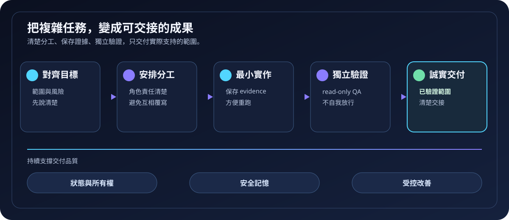
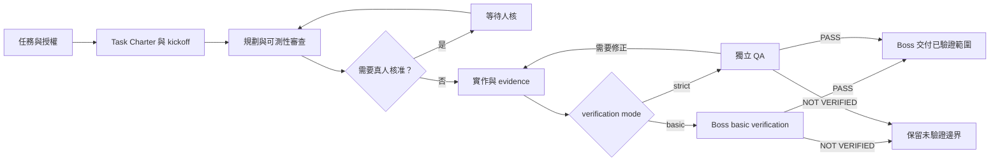

# 打工人集團

> 讓複雜任務不只「做完」，而是**可交接、可驗證、有人負責**。

`orchestrating-workers-group` 是給 Codex 使用的協作 Skill。它把需要多角色合作的任務，整理成一條可追溯的交付路徑：先對齊目標，再分工實作、保存證據，預設由 Boss 做基本驗證；只有明確要求時才交由獨立 QA（品質驗證）做 strict verification。

> 目前產品版本：V0.5.0



對齊範圍 → 分工實作 → 保存證據 → Boss basic verification（或 strict QA）→ 只交付已驗證範圍

**三個承諾：** 範圍清楚 · 證據可回看 · 未驗證不過度宣稱

[快速開始](#快速開始) · [能力地圖](#功能與用途) · [角色分工](#預設四個角色與-strict-qa) · [工作流程](#工作流程架構) · [安裝邊界](#安裝方式)

> [!TIP]
> 適合跨模組改動、高風險決策、多人協作，或你希望每個「完成」都能附上可重跑證據的任務。

## 功能與用途

### 十個公開可查的能力

| 能力 | 解決什麼問題 | 公開佐證 |
| --- | --- | --- |
| 1. 任務授權與目標對齊 | 在動工前把目標、範圍與交付物寫清楚。 | [Task Charter 模板](assets/task-charter.template.json) · [建立工具](scripts/create_task.py) |
| 2. Basic/strict 角色與單一責任 | 預設由四角色協作並由 Boss 驗證；需要時才加入 strict-only QA。 | [角色合約](references/role-contracts.md) · [角色模型](references/role-operating-model.md) |
| 3. 狀態、所有權與可回復流程 | 讓工作知道現在在哪一關、誰負責，以及卡住後從哪裡續做。 | [流程狀態機](references/workflow-state-machine.md) · [狀態儲存](scripts/state_store.py) · [轉換驗證](scripts/validate_transition.py) |
| 4. 會議與交接 | 把關鍵決定、替代方案與下一位負責人留成結構化紀錄。 | [會議劇本](references/meeting-playbook.md) · [會議工具](scripts/meeting_record.py) |
| 5. Evidence-first 與分級驗證 | 用命令、輸出與產物證據支撐交付；basic 由 Boss 產生 `boss_verification`，strict 才由 QA 重跑。 | [evidence 說明](references/acceptance-and-evidence.md) · [QA report 模板](assets/qa-report.template.json) · [報告驗證](scripts/validate_report.py) |
| 6. 誠實的未驗證邊界 | 不把 build 成功延伸成未實測的 runtime、browser、hardware 或外部服務成功。 | [Skill 邊界](SKILL.md) · [evidence 邊界](references/acceptance-and-evidence.md) |
| 7. 隱私導向的長期記憶（memory） | 以 redaction（遮蔽）和審查保護可重用經驗，支援儲存、檢索、整理與修復。 | [memory 架構](references/memory-architecture.md) · [遮蔽工具](scripts/memory_guard.py) · [儲存工具](scripts/memory_store.py) · [檢索工具](scripts/memory_retriever.py) · [整理工具](scripts/memory_consolidator.py) · [修復工具](scripts/memory_repair.py) |
| 8. 受控的 Skill Doctor 與 rollback | 以結構化提案處理可驗證改善；高風險變更停在真人核准。 | [改善政策](references/self-improvement-policy.md) · [提案模板](assets/improvement-proposal.template.json) · [Skill Doctor](scripts/skill_doctor.py) |
| 9. 技能席與問責評分卡（scorecard） | 把專門顧問建議與角色表現評估留在可追溯、不可越權的範圍。 | [能力與技能席](references/intelligence-tiers.md) · [成長規則](references/accountability-and-growth.md) · [技能席模板](assets/skill-seat.template.json) · [評分工具](scripts/evaluate_scorecard.py) · [評分卡儲存](scripts/scorecard_store.py) |
| 10. 已設定 host 的生命週期掛鉤（configured host Hook）與機械防呆 | 在已設定的 Codex host 環境中，提供 lifecycle 提示、範圍檢查、路徑支援、結構檢查與壓力情境測試。 | [Hook 說明](references/hooks-reference.md) · [Hook dispatcher](scripts/workers_group_hook.py) · [Skill 結構檢查](scripts/validate_skill.py) · [路徑支援](scripts/workers_group_paths.py) · [Hook 測試](tests/test_hooks.py) · [壓力情境](tests/scenarios/stress-scenarios.json) |

這些能力的目的不是增加流程，而是讓每個承諾都有範圍、負責人與可回看的依據。

<details>
<summary>展開查看完整公開工具與模板</summary>

目前公開目錄有 16 個 Python scripts；以下依五個工具組列出。它們是可檢視的工具本體，是否能執行仍取決於所在專案與 host runtime。

| 工具組 | 公開 scripts | 能帶來的好處 |
| --- | --- | --- |
| 任務與交接 | [create_task.py](scripts/create_task.py) · [meeting_record.py](scripts/meeting_record.py) | 建立結構化任務與交接紀錄。 |
| 狀態與驗證 | [state_store.py](scripts/state_store.py) · [validate_transition.py](scripts/validate_transition.py) · [validate_report.py](scripts/validate_report.py) · [validate_skill.py](scripts/validate_skill.py) | 保存狀態，並檢查流程、報告與 Skill 結構。 |
| 隱私記憶 | [memory_guard.py](scripts/memory_guard.py) · [memory_store.py](scripts/memory_store.py) · [memory_retriever.py](scripts/memory_retriever.py) · [memory_consolidator.py](scripts/memory_consolidator.py) · [memory_repair.py](scripts/memory_repair.py) | 遮蔽敏感內容、保存、檢索、整理與修復長期記憶。 |
| 改善與問責 | [skill_doctor.py](scripts/skill_doctor.py) · [evaluate_scorecard.py](scripts/evaluate_scorecard.py) · [scorecard_store.py](scripts/scorecard_store.py) | 以結構化方式處理改善提案與證據支持的評分。 |
| host 整合 | [workers_group_hook.py](scripts/workers_group_hook.py) · [workers_group_paths.py](scripts/workers_group_paths.py) | 為已設定的 host 提供 lifecycle dispatcher 與穩定路徑支援。 |

| 模板種類 | 用途與好處 |
| --- | --- |
| [task-charter.template.json](assets/task-charter.template.json) | 把任務目標、範圍與驗收先寫清楚。 |
| [skill-seat.template.json](assets/skill-seat.template.json) | 限定專門顧問輸入的範圍與責任。 |
| [scorecard.template.json](assets/scorecard.template.json) | 用可追溯欄位記錄角色表現評估。 |
| [role-report.template.json](assets/role-report.template.json) | 讓角色交接有一致的結果與證據格式。 |
| [qa-report.template.json](assets/qa-report.template.json) | 讓獨立 QA 清楚記錄 verdict 與範圍。 |
| [memory.template.json](assets/memory.template.json) | 以受控欄位保存可重用的經驗候選。 |
| [meeting.template.json](assets/meeting.template.json) | 把關鍵決定、行動與後續狀態留成紀錄。 |
| [improvement-proposal.template.json](assets/improvement-proposal.template.json) | 讓改善提案具備風險、驗證與 rollback 脈絡。 |

</details>

## 重要說明

> [!WARNING]
> 此 repository 是目前全域 `orchestrating-workers-group` 的**技能本體來源**。它不包含自動安裝器、全域 Hook 設定、帳號憑證或完整 host runtime；不能把 clone 成功當成整套環境已可執行。

> [!NOTE]
> memory、Hook 與 scorecard 需要所在專案或 Codex host 的對應 runtime／設定才會運作。公開原始碼可供檢視與部署，不代表每一項機械工具能在乾淨 clone 中直接執行。

- 請在複雜、多階段、高風險，或明確需要規劃、實作與 QA 分離的工作中啟用。
- 真實憑證、不可逆資料變更、外部帳號或費用，以及重大產品方向，仍需要真人明確核准。
- 本 Skill 不取代專案既有的 `AGENTS.md`、安全政策或使用者指示；規則衝突時，應先停下並說明。

## 安裝方式

此 repository 沒有自動安裝腳本。若你的 Codex host 已支援本機 Skill，請依既有部署與核准流程採用完整目錄，而不是只複製 `SKILL.md`：

```text
<CodexHome>/skills/orchestrating-workers-group/
├── SKILL.md
├── agents/
├── assets/
├── references/
├── scripts/
└── tests/
```

採用後請由你的 host 重新載入或重新發現 Skill，再確認它能被列出與呼叫。不要直接覆蓋正在使用的版本；全域 Hook、runtime 與外部設定仍應按你的環境變更管理流程另外審查。

## 使用教學

### 快速開始

在任務一開始明確呼叫 Skill，並把可驗收的事情說清楚：

```text
$orchestrating-workers-group

請把匯出流程改為可重試，保留舊資料格式。
請先規劃、實作、做獨立 QA，並附上可重跑的驗證證據。
```

### 寫出好任務的最小模板

```text
$orchestrating-workers-group

目標：
範圍與不可改動的部分：
完成後要能驗證的結果：
已知風險或需要真人決定的事項：
不要把哪些未實測範圍宣稱為完成：
```

### 何時使用

| 情境 | 建議 |
| --- | --- |
| 跨模組改動、資料遷移、需要 rollback 的變更 | 啟用，先把範圍與驗證方式寫清楚。 |
| 多人或多代理需要分工 | 啟用，讓 PM 維護檔案所有權與交接。 |
| 只改一行字、一般問答、低風險小修 | 通常不必啟用。 |

### 預設四個角色與 strict QA

| 角色 | 專注的責任 | 不能取代 |
| --- | --- | --- |
| Boss／老大 | 對齊授權、整合證據、basic mode 產生 `boss_verification`，向真人誠實回報。 | strict mode 的獨立 QA verdict。 |
| Planner／軍師 | 拆解工作、風險、依賴與可驗證計畫。 | Executor 的實作所有權。 |
| PM／管事 | 維護狀態、檔案所有權、交接與 blocker。 | basic/strict verification verdict。 |
| Executor／打工仔 | 在已分配範圍內最小實作，保存可重跑 evidence。 | 自己工作的 verification verdict。 |
| QA／驗收官（strict-only） | 只有 strict mode 才用唯讀、獨立方式驗證範圍並給出 verdict。 | production 實作或未跑環境的證明。 |

## 文件結構

```text
.
├── SKILL.md       # 啟動條件、協作規則與階段導讀
├── agents/        # Codex 介面描述
├── assets/        # Task Charter、QA report、會議、memory 等模板
├── references/    # 角色、流程、evidence、Hook 與治理說明
├── scripts/       # 狀態、報告、會議、memory 與 Skill Doctor 工具
└── tests/         # 核心治理規則與壓力情境的測試
```

想先了解行為，從 [SKILL.md](SKILL.md) 開始；想查規則，閱讀 [references/](references/)；想檢視機械工具，查看 [scripts/](scripts/)；想了解測試覆蓋，前往 [tests/](tests/)。

## 工作流程架構



**文字版流程：** 先對齊授權，再規劃與分工；如果需要新的真人決定，就停在等待人核。Executor 保存實作 evidence 後，預設由 Boss 做 basic verification；只有 strict mode 才由 QA 獨立重跑。任一 verification 要求修正時回到實作；無法實測的範圍標為 `NOT VERIFIED`，不會被包裝成已完成。Boss 只能對外說明實際 verification 支持的範圍。

### Verification mode

| 模式 | 預設角色 | 完成條件 | 適用情境 |
| --- | --- | --- | --- |
| `basic` | Boss、Planner、PM、Executor | Boss `boss_verification`、focused checks、可讀 evidence、limitations 與必要安全檢查 | 一般複雜任務與本機可逆修改 |
| `strict` | basic 四角色加 `workers_qa` | QA report `PASS`、可讀 evidence 與 Boss review | 明確要求完整／獨立／嚴格 QA，或需要 browser、device、provider、production、hardware、compute use、security audit 實測 |

basic mode 不會自動使用 compute use，也不會把 simulated、build 或靜態檢查當成 runtime、browser、hardware、provider 或 production 證明。需要這些範圍時請在需求中明確寫出「完整 QA」或指定實測環境。

## 版本歷程

### V0.5.0 — 2026-08-10

- 預設治理流程改為 Boss-owned `basic` verification，未明確要求時不啟動 `workers_qa`。
- 保留 `strict` verification 與獨立 QA report，支援完整驗收、外部環境實測與 Skill/Hook 發布 QA。
- `Task Charter`、Hook、transition validator 與 evidence 文件新增 `verification_mode` 與 `boss_verification` 契約。
- 保留 security、trust boundary、data loss prevention、accessibility 與 `NOT VERIFIED` 邊界；未執行的環境不會被宣稱為已驗證。

### V0.4.1 — 2026-08-09

相較於上一版 `V0.4.0`，本版把 delegated worker 的長時間進度觀測補成可追溯的 heartbeat 閉環：

- 新增 repository-relative external heartbeat artifact，要求記錄 checkpoint deadline、owner、phase、last command、next step 與 exact resume point。
- 明確規定 bounded wait timeout 只代表觀察窗口到期；後續以非中斷 checkpoint 續問，依序探測 `status`、`artifact`、`process/log` 與 `exit code`，不會因 timeout 強制中斷長任務。
- 缺少可讀 evidence 時只能標記 `PARTIAL`、`BLOCKED` 或 `NOT_VERIFIED`，不得補寫 `PASS` 或視為完成；保留獨立 QA 與 fresh clone 的既有驗收邊界。

### V0.4.0 — 2026-08-09

相較於上一版 `v0.3.1`，本版把可重用經驗納入受限制、可回復且可驗證的自動學習閉環：

- 新增受限自動學習規則區與 `Skill Doctor` 的 `learned_skill_rule` 流程；只有具備 failing baseline、backup、獨立 QA `PASS`、Boss review 且不擴大權限的規則，才能自動追加到 `SKILL.md`。
- 新增 verified-success memory activation：只有 `CLOSED` 任務、獨立 QA `PASS`、來源角色不是 `workers_qa`，且 evidence 在 repository 內完整綁定時，經驗才可自動升為 `ACTIVE`；其他經驗維持 `CANDIDATE`。
- 強化 memory 與 Hook 的 evidence binding、redaction、self-review 防護、repair/retrieval/feedback 邊界，並新增 `tests/test_autolearning_global.py` 與相關 regression coverage。

### v0.3.1 — 2026-08-02

- 明確區分機械識別與人類顯示：子代理建立時使用固定 ASCII role identifier；`打工人_老大`、`打工人_軍師`、`打工人_管事`、`打工人_打工仔`、`打工人_驗收官` 用於對真人、會議與交接。
- 不新增角色，不改變權限、檔案所有權或獨立 QA 閘門。

### v0.3.0 — 2026-08-01

- 將公開 repository 收斂為目前的 Skill 本體，並補齊使用說明、功能導覽與首屏流程視覺。

## 版權與授權

此 repository 目前未附 `LICENSE` 檔案。使用、複製或再發布前，請先向 repository 維護者確認授權範圍。
